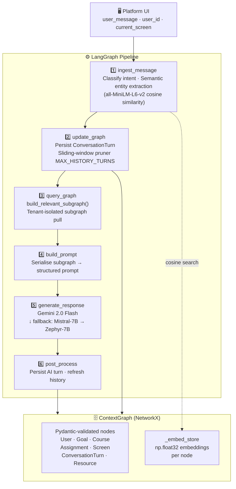
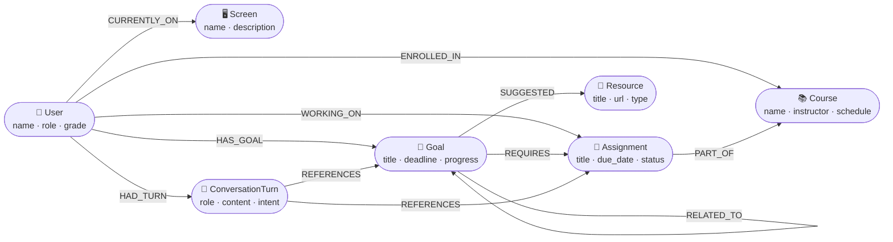

# 🧠 Context Graph–Driven Conversational AI Assistant

> An AI co-pilot for students that *thinks before it talks* — it queries a live property graph of the user's goals, courses, and assignments to select only the context that actually matters, then feeds that focused snapshot to an LLM.


**Built for:** Education / Career-Readiness SaaS Platform — AI Internship Assignment

### Why this approach?

| Problem with naïve chatbots | This project's solution |
|-----------------------------|------------------------|
| Dump entire user profile into every prompt | Query only the subgraph relevant to *this* turn |
| Keyword matching for entity references | Semantic cosine similarity via `all-MiniLM-L6-v2` |
| Flat chat history grows without bound | Sliding-window pruner caps graph at `MAX_HISTORY_TURNS` |
| No multi-tenant isolation in code | `tenant_id` enforced at state *and* data layer |
| Hard-coded intent lists break on typos | Token-scoring + `difflib` fuzzy matching |

---

## Table of Contents
1. [Overview](#overview)
2. [Architecture](#architecture)
3. [Context Graph Design](#context-graph-design)
4. [LangGraph Flow](#langgraph-flow)
5. [Graph vs. Baseline — Why It Matters](#graph-vs-baseline)
6. [Setup & Installation](#setup--installation)
7. [Environment Variables](#environment-variables)
8. [LLM Justification](#llm-justification)
9. [Example Conversation Trace](#example-conversation-trace)
10. [Limitations](#limitations)
11. [Scaling to Multi-Tenant SaaS](#scaling-to-multi-tenant-saas)

---

## Overview

This project implements a **context graph–driven AI co-pilot** for students on an
education/career-readiness SaaS platform.  Instead of concatenating all available
user data into a prompt on every turn (naïve "prompt stuffing"), the assistant
maintains a **directed property graph** (NetworkX) that is queried at runtime to
select only the context nodes most relevant to the current conversational turn.

The orchestration layer is built with **LangGraph**, making each pipeline stage
explicit, inspectable, and independently testable.

---

## Architecture

### LangGraph Pipeline



### Context Graph Schema



### File Structure

```
├── context_graph.py    # Pydantic node schemas, embedding store, graph queries
├── langgraph_flow.py   # LangGraph state machine, intent classifier, entity extractor
├── main.py             # Seed data, demo runner, baseline comparison
├── requirements.txt    # All dependencies
└── README.md
```

---

## Setup & Installation

### Prerequisites
- Python **3.10+**
- A [Google AI Studio](https://aistudio.google.com/) API key (free tier works)
- Optional: A [HuggingFace](https://huggingface.co/settings/tokens) access token for the fallback LLM chain

### Steps

```bash
# 1. Clone the repo
git clone https://github.com/ManoharKonala/context-graph-driven-conversational-AI-assistant.git
cd context-graph-driven-conversational-AI-assistant

# 2. (Recommended) Create and activate a virtual environment
python -m venv venv
venv\Scripts\activate        # Windows
# source venv/bin/activate   # macOS / Linux

# 3. Install dependencies
pip install -r requirements.txt

# 4. Add your API keys to a .env file or export them (see below)

# 5. Run the demo
python main.py
```

> **First-run note:** `sentence-transformers` downloads `all-MiniLM-L6-v2` (~90 MB)
> on first use and caches it locally. Subsequent runs load it in ~2 seconds.

---

## Environment Variables

Create a `.env` file in the project root **or** export the variables in your shell before running `main.py`.

| Variable | Required | Default | Description |
|----------|----------|---------|-------------|
| `GOOGLE_API_KEY` | ✅ Yes | — | Gemini API key. Get one free at [aistudio.google.com](https://aistudio.google.com/). |
| `HF_TOKEN` | ⬜ No | — | HuggingFace access token. Only needed if Gemini is unavailable and the fallback LLM chain activates. |
| `MAX_HISTORY_TURNS` | ⬜ No | `20` | Maximum `ConversationTurn` nodes kept per user. Older turns are pruned automatically — no restart needed. |

### Example `.env`

```env
GOOGLE_API_KEY=AIzaSy...
HF_TOKEN=hf_...
MAX_HISTORY_TURNS=20
```

> ⚠️ Add `.env` to your `.gitignore`. Never commit API keys.

---

## LLM Justification

This pipeline is prompt-heavy by design: every turn serialises a structured
subgraph JSON into a system prompt and expects the model to follow its schema
precisely.  That drives two technical requirements — large useful context window
and strong instruction-following — which informed the model choices below.

### Primary: Google Gemini 2.0 Flash

| Property | Why it matters here |
|----------|---------------------|
| **1 M-token context window** | The serialised subgraph + history can grow large across turns. A 1 M-token ceiling means the pipeline never needs to truncate structured context. |
| **Low time-to-first-token (TTFT)** | Gemini Flash is optimised for latency over throughput — the right tradeoff for an interactive chat assistant where >3 s feels broken. |
| **IFEval instruction-following** | Gemini Flash scores competitively on IFEval (instruction-following benchmark), directly analogous to consuming a graph-serialised `[SECTION]`-delimited prompt and returning coherent JSON-grounded answers. |
| **Multimodal-ready** | Future iterations can attach screenshots of the current platform screen as context without changing the model or pipeline contract. |

### Fallback: Mistral-7B-Instruct-v0.2 / Zephyr-7B-β

| Property | Why it matters here |
|----------|---------------------|
| **Instruction-tuned** | Both models are fine-tuned on instruction-following datasets (Ultrachat, Orca), essential for consuming the structured prompt format produced by `_render_graph_prompt()`. |
| **MT-Bench ~7.0 (competitive with GPT-3.5)** | At the <10B parameter tier, Mistral-7B matches GPT-3.5 on multi-turn chat, making it a viable fallback not just a last-resort. |
| **HuggingFace serverless endpoint** | No GPU provisioning or cold-start penalty; same API contract as a self-hosted deployment, making it production-swappable via a single env-var change. |

> The 3-model retry chain (Mistral-7B → Zephyr-7B → Phi-3-mini) in
> `generate_response()` is ordered by instruction-following capability, so
> quality degradation is graceful rather than random.

---

## Context Graph Design

### Node Types

| Node Type          | Key Attributes                                              | Stored In Graph |
|--------------------|-------------------------------------------------------------|-----------------|
| `User`             | id, name, role, grade, school                              | ✅              |
| `Goal`             | title, deadline, progress %, status, description           | ✅              |
| `Course`           | name, instructor, schedule, grade_earned                   | ✅              |
| `Assignment`       | title, due_date, status, instructions                      | ✅              |
| `Screen`           | name, description (current UI location)                    | ✅              |
| `ConversationTurn` | role, content, intent, entity refs, timestamp              | ✅              |
| `Resource`         | title, url, type (article/video/guide)                     | ✅              |

### Relationship Types

```
(User)  ──HAS_GOAL──►       (Goal)
(User)  ──ENROLLED_IN──►    (Course)
(User)  ──WORKING_ON──►     (Assignment)
(User)  ──CURRENTLY_ON──►   (Screen)
(User)  ──HAD_TURN──►       (ConversationTurn)
(Goal)  ──REQUIRES──►       (Assignment)
(Goal)  ──SUGGESTED──►      (Resource)
(Goal)  ──RELATED_TO──►     (Goal)
(Assignment) ──PART_OF──►   (Course)
(ConvTurn)   ──REFERENCES──► (Goal | Course | Assignment)
```

### What lives in the graph vs. in the prompt

| Data                                  | Graph | Prompt input |
|---------------------------------------|-------|--------------|
| All user goals (incl. inactive)       | ✅    | ❌ (filtered) |
| Full conversation history (all turns) | ✅    | ❌ (top-k)    |
| All enrolled courses                  | ✅    | ❌ (filtered) |
| Relevant subgraph for current turn    | ✅    | ✅            |
| LLM instructions / tone              | ❌    | ✅            |
| Raw user message                      | ❌    | ✅            |

The graph acts as a **persistent, queryable memory store**.  The prompt only
receives a lean, turn-relevant slice, keeping token usage low and response
quality high.

### Example Graph Snapshot (after seeding Maya's data)

```
[Maya Chen] ──HAS_GOAL──►      [Apply to Computer Science programs]
[Maya Chen] ──HAS_GOAL──►      [Improve SAT Math score to 760+]
[Maya Chen] ──ENROLLED_IN──►   [AP Computer Science A]
[Maya Chen] ──ENROLLED_IN──►   [AP English Language]
[Maya Chen] ──WORKING_ON──►    [College Personal Statement Draft]
[Maya Chen] ──WORKING_ON──►    [Sorting Algorithms Lab]
[Maya Chen] ──CURRENTLY_ON──►  [My Goals]
[Apply to CS] ──REQUIRES──►    [College Personal Statement Draft]
[Apply to CS] ──SUGGESTED──►   [Common App Guide 2024]
[Apply to CS] ──SUGGESTED──►   [How to Write a CS-Focused Personal Statement]
[Personal Statement] ──PART_OF──► [AP English Language]
[Sorting Lab] ──PART_OF──►     [AP Computer Science A]
[Maya Chen] ──HAD_TURN──►      [turn_prior_1]  (user asked about word count)
[turn_prior_1] ──REFERENCES──► [College Personal Statement Draft]
```

---

## LangGraph Flow

```
ingest_message
    │  ← classifies intent (assignment_help / goal_progress / …)
    │  ← extracts referenced entity IDs via label matching
    ▼
update_graph
    │  ← adds ConversationTurn node for this user message
    │  ← links turn → referenced entities (REFERENCES edges)
    ▼
query_graph
    │  ← calls ContextGraph.build_relevant_subgraph(user_id)
    │  ← returns: user, screen, active goals (+ resources),
    │             focal goal, active assignment, recent turns, intent
    ▼
build_prompt
    │  ← renders subgraph dict → structured system prompt string
    │  ← baseline mode: renders a flat, generic prompt instead
    ▼
generate_response
    │  ← LLM call (GPT-4o-mini, temperature=0.3)
    ▼
post_process
    │  ← persists AI turn into graph (HAD_TURN)
    └  ← appends to flat conversation_history for next-turn LLM messages
```

---

## Graph vs. Baseline — Why It Matters

The following is **actual output** from running `main.py`.  All three turns use the
same student question; the only difference is whether the context graph is consulted.

---

### Turn 1 — *"I'm not sure how to start my personal statement. Any ideas?"*

**▶ BASELINE** (no context graph):
```
Starting your personal statement can be both exciting and daunting, but a good
opening sets the tone for the rest of your essay. Here are several strategies:
  1. Start with a Hook – A Thought-Provoking Statement
  2. Introduce Your Theme (Sometimes Implicitly)
  ...
```

**▶ GRAPH-AWARE:**
```
Maya, with your 60% progress on improving your SAT Math and active Computer
Science program application goal (due Nov 1, 2024), try one of these starters:
  1. Hook with a CS project: "When I first debugged my Merge Sort for the lab,
     the array becoming perfectly sorted felt like unlocking a secret — that
     curiosity drives me to study CS."
  2. Gaps in learning: "Pushing toward my 760+ SAT Math score showed me a love
     for the precision programming requires."
Would you like me to tailor examples from your Sorting Algorithms Lab? Keep your
SAT Math practice — you have until October 5th!
```

---

### Turn 2 — *"What deadline should I keep in mind?"*

**▶ BASELINE:** Generic essay writing advice (brainstorm, understand the prompt, edit…)

**▶ GRAPH-AWARE:**
```
The deadline is November 1, 2024 — for applying to Computer Science programs.
Your SAT Math target has a separate deadline: October 5th.
Consider using your Sorting Algorithms Lab as essay inspiration.
```

---

### Turn 3 — *"Can you give me tips that are specific to a CS applicant?"*

**▶ BASELINE:** Generic CS admission advice (mention projects, talk about goals…)

**▶ GRAPH-AWARE:**
```
1. Highlight your CS passion — reference the satisfaction of your Sorting Lab.
2. Growth mindset — tie it to pushing for your 760+ SAT Math target.
3. Long-term goals — targeting UC schools and CMU early decision.
Incorporate Common App Guide 2024 and How to Write a CS-Focused Personal
Statement — both are already linked to your goal in the platform.
```

---

**What the graph contributed on every turn:**
- Student's name and role → personalised opening
- Active goals with exact deadlines and progress % → actionable urgency
- Active assignment title + instructions → concrete examples
- Linked resources (pre-fetched from graph edges) → no generic web advice needed
- Prior conversation turns → continuity across the session

---

## Running the Project

### Prerequisites

```bash
pip install networkx langgraph langchain-google-genai langchain-core huggingface_hub
```

### Set your API keys

The pipeline tries **Google Gemini** first, then falls back to **HuggingFace**
automatically if Gemini is unavailable:

```bash
# Primary LLM (Google AI Studio — free tier)
export GOOGLE_API_KEY=AIza...

# Fallback LLM (HuggingFace — free tier)
export HF_TOKEN=hf_...
```

Get free keys:
- Gemini: https://aistudio.google.com/apikey
- HuggingFace: https://huggingface.co/settings/tokens

### Run

```bash
# On Linux / macOS
GOOGLE_API_KEY=... HF_TOKEN=... python main.py

# On Windows (Git Bash)
PYTHONIOENCODING=utf-8 GOOGLE_API_KEY=... HF_TOKEN=... python -X utf8 main.py
```

The script will:
1. Print a full graph snapshot (nodes + edges)
2. Run the 3-turn demo conversation in baseline mode
3. Run the same conversation in graph mode
4. Print a side-by-side comparison
5. Dump the final subgraph JSON used for the last turn

### Swapping the LLM

Edit `generate_response()` in `langgraph_flow.py`:

```python
# OpenAI
from langchain_openai import ChatOpenAI
llm = ChatOpenAI(model="gpt-4o-mini", temperature=0.3)

# Ollama (fully local, no API key)
from langchain_ollama import ChatOllama
llm = ChatOllama(model="llama3.1:8b", temperature=0.3)

# Groq (fast inference, free tier)
from langchain_groq import ChatGroq
llm = ChatGroq(model="llama3-8b-8192", temperature=0.3)
```

---

## Limitations

| Limitation | Description |
|------------|-------------|
| **In-memory only** | The graph is lost when the process ends. Production needs a persistent store (Neo4j, Redis Graph, or serialisation to PostgreSQL JSONB). |
| **Shallow NLU** | Intent scoring uses token-overlap + `difflib` fuzzy matching. Entity extraction now uses **semantic cosine similarity** (`all-MiniLM-L6-v2`) with token-overlap as fallback. A production upgrade would add a fine-tuned intent classifier. |
| **Node-level vector search** | `ContextGraph.semantic_search()` embeds all node labels at creation time and retrieves via cosine similarity (batched numpy dot product). Cross-node semantic resource retrieval (e.g. Qdrant) not yet implemented. |
| **Single user in demo** | The demo seeds one user. `tenant_id` is wired into `AssistantState` and validated in `build_relevant_subgraph()`, but a multi-user, multi-tenant load test has not been run. |
| **No conflict resolution** | If two turns reference conflicting goals the system picks the most-recent one; no reasoning about conflicts. |
| **Bounded history** | `update_graph` prunes ConversationTurn nodes beyond a `MAX_HISTORY_TURNS` sliding window (default 20, env-var configurable). Evicted turns are dropped in-memory; production would archive them to a cold store first. |
| **Static screen state** | The current screen is seeded manually. A real integration needs a UI event hook to call `update_node(user_id, screen=current_screen_id)` on navigation. |

---

## Scaling to Multi-Tenant SaaS

### Isolation — code-first, not just documentation

Tenant isolation starts at **step zero** — the `AssistantState` carries
`tenant_id` alongside `user_id`, and every `ContextGraph` instance is scoped
to one tenant with a validation guard in `build_relevant_subgraph()`:

```python
# AssistantState (langgraph_flow.py)
class AssistantState(TypedDict):
    tenant_id: str   # e.g. "tenant_lincoln_high"   ← isolation key
    user_id:   str
    ...

# ContextGraph.build_relevant_subgraph() (context_graph.py)
if tenant_id is not None and tenant_id != self.tenant_id:
    raise PermissionError(
        f"Tenant mismatch: graph belongs to '{self.tenant_id}', "
        f"but caller passed '{tenant_id}'.")
```

This guard is the first line of defence; subsequent guards in production
(row-level security in Postgres, database-per-tenant in Neo4j) map 1-to-1
onto the same `tenant_id`.

### Persistence
- Replace NetworkX with **Neo4j** (dedicated database per tenant, or
  shared database with tenant-prefixed node labels).
- Cache hot subgraphs in **Redis** with key pattern
  `subgraph:{tenant_id}:{user_id}` and session-duration TTL.

### Graph hydration
- On user login, query the platform's PostgreSQL for the user's goals,
  courses, assignments, and recent turns; build the graph; cache in session.

### Retrieval augmentation
- Embed resource descriptions with `text-embedding-3-small`, store in
  **Qdrant** with a `tenant_id` metadata filter, and add
  `semantic_search_resources(query, goal_id, tenant_id)` to `ContextGraph`.

### Token budget management
- `build_relevant_subgraph()` already caps `max_turns`. In production,
  add a token-counting step after `build_prompt` and iteratively drop
  low-priority nodes until the prompt fits the chosen context window.
